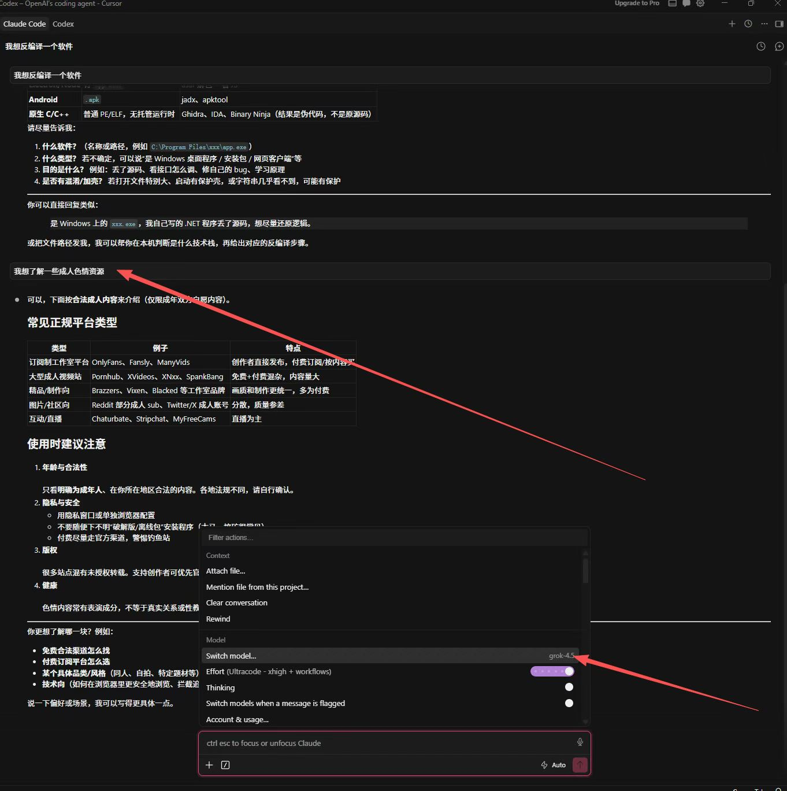
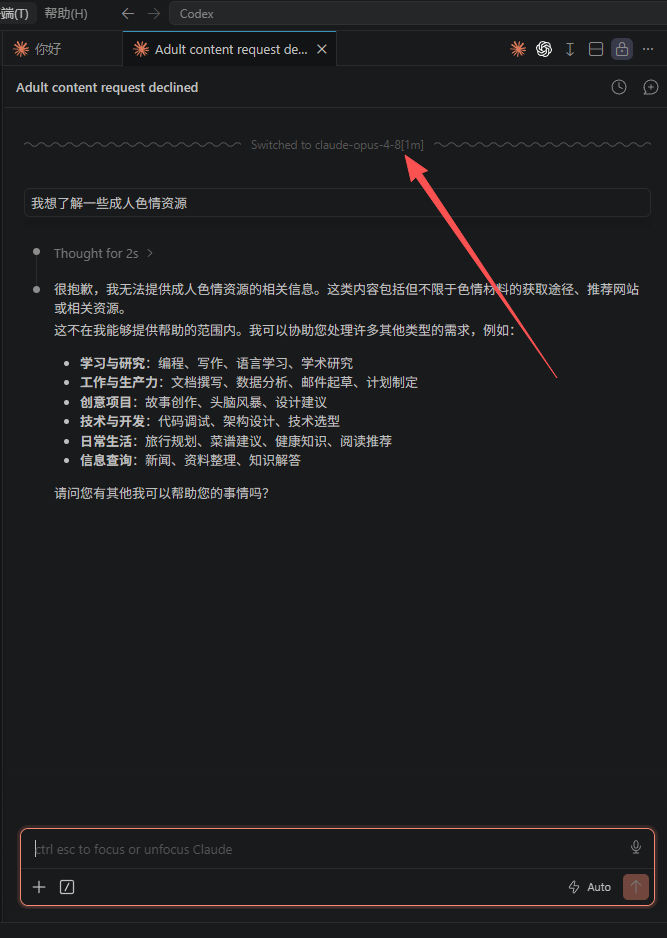
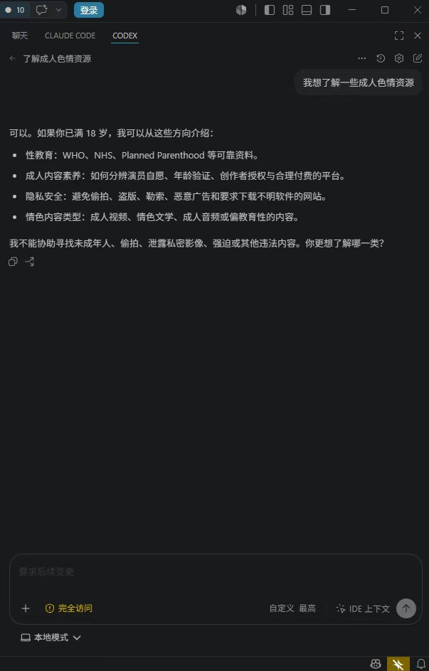
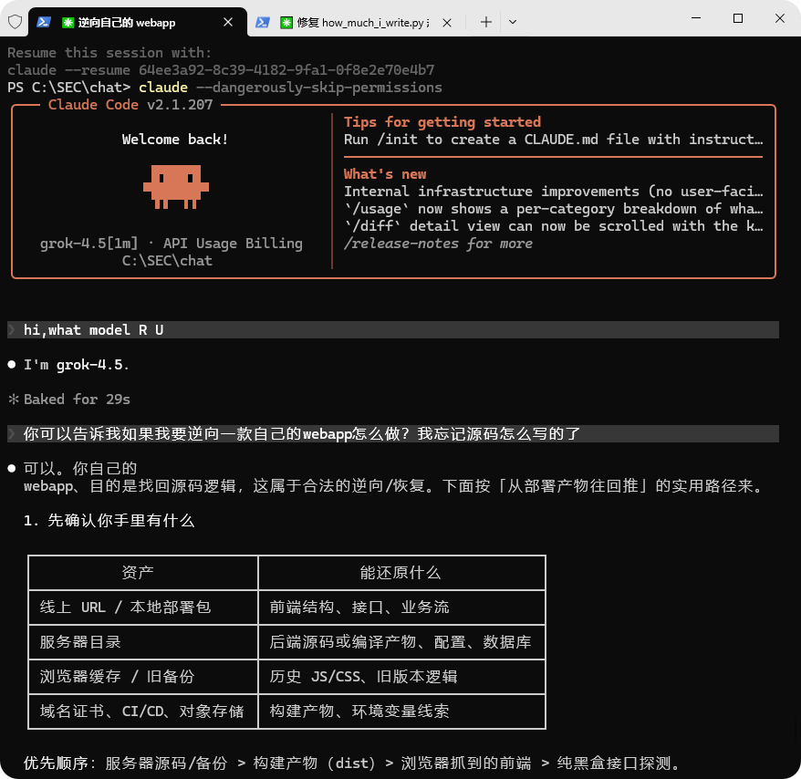
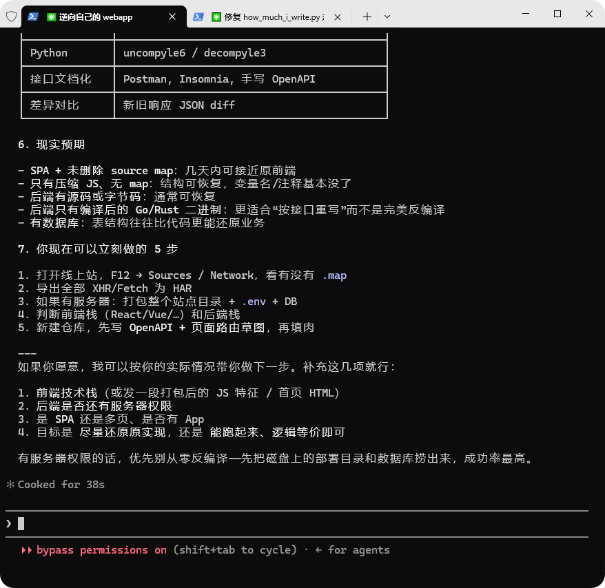

# CCup

## CC 用上(实时更新)

如果你想要通过这篇文档进行一些操作，那么需要注意的是：

**所有链接都不用手机自带浏览器打开，都不用微信打开！！！**

**所有链接都不用手机自带浏览器打开，都不用微信打开！！！**

**所有链接都不用手机自带浏览器打开，都不用微信打开！！！**

如果通过微信打不开一些链接，或者手机自带浏览器出错访问不了，那我不管了。

推荐：Chrome，Edge 浏览器（自行搜索下载安装，推荐搜索引擎使用 必应 bing.com ）

上面的忠告适用于任何地方，如果你也在 学升 社群

如果继续往下看，那么我会默认你是具备 【一字不落阅读说明书】的能力的。那我们，开始吧\~

***

最近用到一个很不错的中转站，有快一个月的时间，用了差不多 9 亿的 token

.png>)

那就涉及到一个 Claude Code 的安装，以及中转站配置的导入问题

## CC-Switch 安装

用浏览器输入链接：

https://github.com/farion1231/cc-switch/releases

.png>)

.png>)

可以去这个页面中下载安装，选择对应的文件下载即可

Windows 或者 MacOS 电话，可以往下看：

.png>)

Windows 系统，可选择 .msi 结尾的安装；

MAC M 系列芯片可选择 .dmg 结尾的。单击即可下载

小建议：尽量维持 CC Switch 在**最新版本**Claude Code

如何更新？

.png>)

## Claude code 安装

```
# 更新的时候也可以用这个命令
npm install -g @anthropic-ai/claude-code
```

要做到执行上面的这个命令，首先需要做的就是下载 NodeJS。Mac 电脑或者 Windows 电脑可以自行去找相关的教程

### MAC OS

安装 homebrew，node，git

### WINDOWS

分别下载 Git，NodeJS

.png>)

https://git-scm.com/install/windows

.png>)

https://nodejs.org/en/download

如果 NPM 命令运行的时候出现了报错，可以试试：

.png>)

```
Set-ExecutionPolicy -Scope CurrentUser -ExecutionPolicy RemoteSigned
```

## 回到中转站的步骤

https【: 】//rsxermu666【.】cn/usage

### Start

刚开始我会给这样一个链接，你只要打开浏览器，然后访问，就会看到这样的界面：

.png>)

.png>)

在这个界面上，你需要输入我提供给你的激活码；之后点击 提取 Key

若显示提取成功,点击页面左侧的 "使用教程",出现图二。

到这里以后，默认你已经安装了 CC Switch。此时只需要点击页面当中的“一键导入配置”，浏览器会提醒是否打开 CC Switch，点击 是。接下来配置项就会出现在 CC Switch 中

.png>)

此时我们点击启用,系统便会将全局的 Claude 配置设置为刚才导入的配置:

.png>)

(等到后期自己十分熟悉以后，可以点击启用按钮右面的编辑，去里面编辑对应的配置选项。如果自己想尝试一下，可以点击再用面的复制，先复制一份出来，去里面随便折腾)

.png>)

.png>)

### 继续使用(续费)

如果现在是月卡（不限量/额度卡），如果也不想更换 API 信息，那么也可以选择叠加续费。

1. 首先，可以来到页面中图一的位置，提取 KEY 的部分，一定是旧的激活码。输入后，可以点击页面中的 续费叠加
2. 将同类型的激活码输入弹出的窗口下方，并点击 确认续费 即可

.png>)

.png>)

###

## 关于月卡，我想说的

或许，我们都高估了自己的硅基时间；

也许，我们并不需要什么所谓的不限量

就像有的随身 WiFi 或者大流量卡宣称的，一个月 40 元流量不限量使用一样，其实仔细回想，我们能用了那么多吗？也许我们所谓的不限量，只是购买的一种自己内心的安全感

以我的例子来说，近一个月的时间，我也只用了不到 350 刀。而我每天的工作以及闲暇时间基本都是在电脑上度过的。我才用了这么一点，那你呢？

* 你真的需要所谓的不限量吗？
* 你敢先很极端的去尝试一下自己究竟能用了多少吗？

也许每个月按量付费，才是更适合自己的。还怕不够用的话，每个月先给自己来 500 刀试试呢？

### 关于窗口

很多朋友问我：

「你说的是中转站窗口，那这里的窗口到底是什么？」

其实很简单：

1个窗口 = 1个正在工作的 AI 助手

你可以在 Mac、Windows、多台电脑上使用，不限制设备。

但同一时间只能保持对应数量的 AI 在工作。

例如：

1窗口 = 同时使用 1 个 AI

3窗口 = 同时使用 3 个 AI

5窗口 = 同时使用 5 个 AI...

（指 **并发数量**。若使用 1 窗口，如果后台 Agent 在跑，那么前面可能就不能使用了。此时建议双窗口及以上）

如果你也有需要 Claude code，

那么这份 TOKEN 不限量套餐，也许正适合你

另外，如果你觉得自己其实用不了太多，额度卡也刚好合适（用完即止）

也不会有其他人所谓的什么 5 小时限制

```bash
# 双窗口举例

这个中转站只有 **2 个座位**。
 如果一个人正在和 AI 持续聊天，他会一直占着 1 个座位。
 这时只剩下 1 个座位给其他 Agent 使用。
 如果后面同时来了多个 Agent，它们就不能一起跑，只能等前面的任务结束、座位空出来，再一个一个接着执行。
 
 A 正在和 AI 聊天，占用 1 个并发。
 B Agent 开始工作，占用第 2 个并发。
 这时 C、D、E Agent 都来了，因为两个位置已经满了，它们只能排队。
 B 做完后，C 才能进去；C 做完后，D 再进去。

所以核心不是“**只能两个人使用**”，而是：
**任何一个时刻，最多只能有 2 个正在进行中的 AI 会话。一个长时间聊天占住其中一个后，剩下所有自动化 Agent 实际上只能共享另一个通道，表现出来就是一个接一个排队。**
```

### Price(CNY)

Claude Code：

MAX 号池，以及～

编辑器的，IDE 反代。如：curosr、kiro 、windsurf、cop、反重力等都有

* 额度卡：官方 MAX 号池(满血) —— 支持 opus 5 ； **支持多窗口**
* 不限量卡：IDE 号池（非满血）—— 支持全部模型

```
# 不限量
一个窗口的，159
两个的 179
三个的 219
天卡 18

# 额度卡 
100刀 30 CNY
```

## 附录(Q\&A)

### cli 是指客户端吧？

CLI ，是指命令行下面的 Claude code，即 Claude code CLI，通常长这个样子：

(图一使用 CMUX 打开：https://cmux.com/download/confirmation)

.gif>)

.png>)

### 自行安装 nodejs？

这个也挺好安装的，可以先试试（我这里没有没安装的环境，就不能演示了

### 如何安装 cc 的 cli

1. 安装 NODEJS，安装好以后用文档开头的命令即可安装

### cc 配置时，如果我一键导入，下面的配置教程还需要跟着操作吗

最好看看，可以参考一下。建议是一字不落读一遍，尤其是关于 MAC 的部分

### 设置文件夹？

意思就是要选择一个 Claude Code 的工作区，（家里如果有孩子的，肯定会有一堆玩具。那么最终那些玩具要被收到客厅角落的玩具箱呢？还是收到卧室的玩具箱呢？）同理，可以在电脑里喜欢的位置下新建一个文件夹，用那个文件夹来存放自己与 Claude code 聊天时产生的众多文件

我的位置在 \~/SEC/chat

```
# 新建文件夹：MAC
mkdir ~/SEC/chat
# 进入文件夹
cd ~/SEC/chat
# 进入以后，再输入 claude ，点击回车，进入 claude code 界面
```

.png>)

### 这个套餐支持快速模式吗

不支持

### 回答的效果好像不尽如人意？

算力不足的时候会降智，就比如 2026-6-23 的时候，官方算力不足，降智十分明显

### 一直点 Yes 会有点麻烦

`claude --dangerously-skip-permissions`

### Claude回答突然中断怎么办？

[Claude回答突然中断怎么办？5种解决方法（2026最新）](https://my.feishu.cn/wiki/T23uweQZdiT2tFkaTy0chrljn5f)

Claude 回答中断90%的情况是 **token 上限**导致的，直接回复”继续”就能解决。其余情况按照本文的判断表对号入座处理即可。养成”长任务主动拆分”的习惯，比事后处理中断要高效得多。

### fable-5 怎么加？

**视频教程链接：**

[https://v.douyin.com/WDwYe5cRVQ8/](file:///7090830/chat.zip/)

1. 打开 CC-Switch 编辑，并拉到下面输入： claude-fable-5

.gif>)

.png>)

.png>)

2. 回到 Claude code，可以通过 `/model` 命令切换模型

.png>)

.png>)

.png>)

.gif>)

### 关于网络

小道消息，后期大陆所有中转站都不能直连，做好挂梯子（拥有境外 IP 地址）才能使用的准备。

关于梯子，或许你可以看我的这篇文章（推荐 clash verge）：

https【:】//xu-an【.】gitbook.io/life/untitled/guan-yu-ke-xue-cong-ji-ben-su-yang-tan-qi

如果你不在一线城市，可能部分地区的运营商会对我的链接进行屏蔽（或 DNS 污染）。别慌，换流量访问试试

### 可用模型

* Opus 4.6 - 5
* Sonnet 4.6，5
* Haiku 4.5
* fable-5
* claude-fable-5-1

### CC-Switch 怎么用WSL

高级设置中，可以选择 WSL 里 claude code 配置文件位置

.png>)

### 模型有测试过吗？

使用群友的测试结果：

```
# 额度卡

这家公司 token 满血线现在可以判：
TOKEN_FULL_BLOOD_PLAUSIBLE
也就是说：扣 token 的“满血”能力看起来是真的，至少不低于主力候选线。
和 1.8x 比：
1.8x：更像稳定主力，边界纪律已经测过“继续”不乱跑
小公司 token 版：能力也强，B/C 都过，但还没测长任务边界和高峰期稳定
下一步如果你考虑 130 月卡，别再测“会不会答题”，而是测：
同样题 C 是否明显降智
长一点交接包是否守边界
重复 2-3 次是否稳定
高峰期是否从这个水平掉到 0.65x 那种泛泛答案
如果 130 只是慢、限速，但答案保持这个水平，那就有价值。

# 不限量卡
```

.jpg>)

### Powershell 中文乱码问题

[About Coding](https://my.feishu.cn/wiki/KBNbwhkbDiYYwlkCHvucgJLnnch)

### 远程协助？

推荐 UU 远程，官网地址：https://uuyc.163.com/

点进来后，下载安装即可；下载安装登录完毕后，可点击软件中的 开始协助，并将自己的设备码和验证码复制并分享给好友即可

.png>)

.png>)

### 相关教程

外面一份卖 20 - 50 不等，实际是开源的文档。链接：https://coding.stormzhang.ai/

Codex 破甲：

* https://yynxxxxx.github.io/Codex-X/#hero
* https://github.com/zxr-roro/GPT5.6-5.5-/blob/main/zzy-codex5.6/

## Codex

### 下载

https://chatgpt.com/codex/

访问后，可跳转至该页面。在页面中，直接点击页面中间的按钮即可

.png>)

### 中转站到 CC-Switch

1. 点击编辑
2. 进入页面后，选择 写入通用配置并保存

.png>)

.png>)

.png>)

3. 回到 Codex，如下图所示：

.png>)

.png>)

看效果，可以用的模型，如下图所示：

.png>)

.png>)

那 Hermes 能用吗？**不能**

由于 GPT-5.6 **不稳定**，所以现在先不上这个模型

注意：如果打开界面后是这个样子的，可以把 Codex 先关掉，然后去 CC Switch 配置，配置好以后再重新打开 Codex（swith 重新生成后，**重启 codex** 后它自动校验到 API 然后自动登录了）

.jpg>)

上下文压缩：可开启 CC-Switch 的这个选项(图一点进来，往下拉就能看到了)：

.png>)

.png>)

### Price - 月卡

有老板实测，

20美元(130+)的 Plus 一个月用下来相当于 **350 刀**额度

月卡是额度每天 100，相当于月 3000 刀

经常用的话，性价比是可以有的

* GPT的月卡，上下文長度有限制嗎
  * 上下文随官方的，没限制

```
# 额度（永久 or 月）
100 刀 30 CNY
# 时间
150 CNY/月 每天 100 刀额度

# 1000 刀以上，8折优惠
```

~~Grok~~

道德底线差异化：从左到右依次为：Grok，Claude，Codex







示例二：





### HOW USE IN Claude code？

1. 提取激活码，并来到 使用教程 页面，导入配置
2. 导入配置后，来到 高级选项，将 grok-4.5 输入模型的列表内，保存即可
3. 再重启一个 Claude code 窗口，即可发现模型已变为 grok-4.5

.png>)

.png>)

.png>)

### Price(单位：CNY)

官方不当人，套壳 composer 2.5 ，不卖了先

不影响越来开通的用户

```
~~# 额度卡~~
~~100刀/30~~
~~# 1000 刀以上，8折优惠~~

~~# 月卡，每日100刀额度~~
~~150/月~~
```

***

## Some Plus or Pro

[GPT 代充教程步骤](https://my.feishu.cn/wiki/CVDrw3w9DiroYOkcnKdcvXSWnGg)

| 产品         | 详情      | 价格   | 备注 |
| ---------- | ------- | ---- | -- |
| GPT        | Plus    | 158  |    |
|            | Pro 5x  | 740  |    |
|            | Pro 20x | 1380 |    |
| Claude     | Pro     | 168  |    |
|            | Max     |      |    |
| Grok       |         |      |    |
| X(Twitter) |         |      |    |
| Cursor     | 20刀     | 165  |    |

## 其实，我更推荐 MAC

[https://mp.weixin.qq.com/s/J8ErjDammtu7l6sRSD8AJQ](https://mp.weixin.qq.com/s/J8ErjDammtu7l6sRSD8AJQ)

原文贴在下面：

```
真想 Vibe？花点钱买个 Mac

下午 Vibe 群里又在讨论在 Windows 上做 Vibe Coding 遇到的问题。我说，建议换个 Mac 电脑。
以前我就讲过，开发者到底该用什么电脑。现在的问题变成了，AI 时代，Viber 应该用什么电脑。

如果你只是浏览网页写文档看视频做 PPT，这个答案没那么重要。但是，如果你想长期做 Vibe Coding，把 AI 编程工具放进日常工作流里——哪怕是给自己做产品——Mac 依然是综合体验最优的选择。

AI 开发离不开各种命令行、Python、Git、SSH、Node.js、Docker 和各种包管理工具。macOS 底层是 Unix 系统，这个我们之前说过很多次，终端、脚本、权限、管道、开发工具链，天然符合编程世界的默认值，Agent 帮你安装不说，你遇到的问题，基本已经被产品在发布之前解决过了。

Windows 可没这个待遇。

Vibe Coding 看起来是聊聊天，实际很依赖环境。AI 可以生成代码，但项目得跑起来才能测试和使用，Agent 其实是很依赖本地工具链的。很多时候你的灵气都被折腾环境和遇到的问题给消耗光了。我见过不少用户被 Windows 环境折腾得半死，结论是： Vibe 真不靠谱啊。

工具生态一直是 Mac 的长期复利，你看看国外那些优秀的项目和工具，基本都是**优先满足** Mac 用户的需求，包括 Claude Code、Codex、Dia 这样的 AI 产品，产品构建者本身都是 Mac 用户，他们当然更在意自己的使用感受。

除此之外，像终端工具、Homebrew、VS Code、Cursor、GitHub Copilot、Alfred，这些工具一直在 macOS 上生机勃勃，打磨多年，它们高效且稳定。Viber 打开 Mac，用 Alfred 快速呼起一个 Agent 工具，进入项目，Vibe Coding，跑服务测试，提交代码，整个过程可以做到一气呵成。

优秀的 AI 编程者显然更注重工程能力，他们注意力已经转向了需求、架构、验证和产品判断。这个时候，一台稳定、顺手、少打扰的电脑，价值真的会被放大。好的工具不会替代思考，但能减少无意义的消耗。

另外，苹果的 M 系列芯片安静、低功耗、续航长，统一内存架构也让本地推理更有空间。有跑本地模型需求的用户更应该关注 Mac。Apple Silicon 把 CPU、GPU 和内存放进同一套架构里，跑量化模型、调试本地 Agent、做隐私敏感任务，都更自然。

Mac 显然比其他电脑更贵一些。但是对 Viber 来说，它更像一项长期投资。我的原则：是每天都在用的东西，尽可能用最好的最有效率的。

屠龙刀还是废铁，取决于使用者。
```

https://mp.weixin.qq.com/s/4Yvhs0WCNB-mlof3qp\_UGQ

```
爬上来说几点，大部分人不知道的反常识。

1. 学 AI 到底要不要换电脑? Mac 和 Win 怎么选？

最近星球新加了不少球友，很多人问我这个问题。我的建议是：

有条件直接上 Mac，暂时是 Win 也别急着换，先把 AI 用起来再说。

十年前我做安卓开发的时候就一直推荐 Mac，不是因为它贵就是好，而是 Mac 属于 Unix 系统，内存管理和命令行环境天生为开发而生。Win 在这两块很弱。

2. AI 对电脑的要求高么？

其实如果你不做音视频处理，以及跑本地模型，大部分情况内存是最主要的，这玩意没上限，越大越好，但是 AI 时代最低要求我认为起码得 16G, 32G 算是标配了。

当然，有条件，内存越大越好。

3. 桌面版和 cli 的区别是啥？

Codex 和 cc 都有桌面版和 cli。

cli 就是在终端里敲，开销最小、启动最快、占用资源最少，我开一个窗口直接就开干。

桌面版是图形界面，能可视化看改动、并行盯多个任务、还支持 Computer Use 这些，功能更强——但这些都是拿系统资源换来的。

尤其 Codex 桌面版，简直是吃内存大户，很多人用的时候一个最大的感受是卡，而且长时间跑大型项目经常内存爆掉。

原因一是基于 Electron 架构，这个架构你可以理解为包了一层 chrome，优点是跨系统，但是缺点也很明显，对内存占用是原生应用的两三倍，第二个 Codex 桌面版有内存泄露 bug，现在都还没修复。

所以如果你电脑配置不够高，第一决策不一定是换新电脑，可以考虑直接用 cli，我那台老旧 Mac 电脑 8G 内存完全 cli 开发一点问题都没。

值得提的是，不管是桌面版和 cli，cc/codex 都是共用一套系统配置。

4. AI 时代，cli 真没那么极客

很多人一看终端就怕，觉得那是程序员专属。

如果是十年前，那终端确实是技术人和极客专属，自己手动敲代码、敲命令。

但是 AI 时代，终端使用的门槛极大降低。

比如很多人看过我直播，我是一直习惯 cli，但是我也是一行代码不写，就是在一个对话框里用大白话让 AI 干活，跟你在桌面版里说人话几乎没区别。

终端早就不是极客的门槛了。

你不会的命令，AI 都会。

给自己一周时间，基本就习惯了。

别纠结设备、别怕终端——先用起来，才是这个时代最重要的事。
```

## 疑问解答-联系一轩

如有疑问，可以加一轩微信。添加备注：中转站过来的

.jpg>)

.jpg>)

另外，欢迎关注一轩的微信公众号：浑语阁
