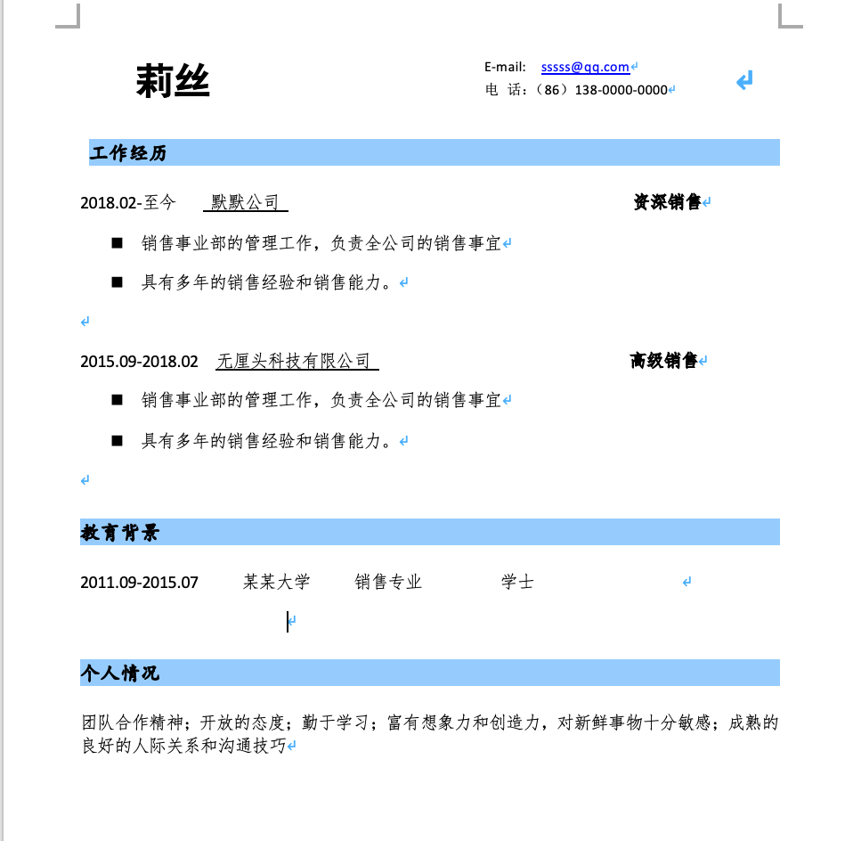

# 如何设计一份好的简历

一份好的简历应该注意的点有：

1. 好的外形
2. 简历的结构与逻辑

其中结构与逻辑部分又分为：

1. 个人信息
2. 教育情况
3. 工作经历
4. 项目经历
5. 自我评价
6. 其他内容

先从简历的外形说起，现在大部分网上的简历模板都是花里胡哨的样子，还有一种就是比较简洁的，下面是一张表格，从表格中，你就可以评判一下，什么样的简历才是一份好简历

<table>
  <thead>
    <tr>
      <th style="text-align:left"></th>
      <th style="text-align:left">&#x4F18;&#x52BF;</th>
      <th style="text-align:left">&#x52A3;&#x52BF;</th>
    </tr>
  </thead>
  <tbody>
    <tr>
      <td style="text-align:left">&#x82B1;&#x91CC;&#x80E1;&#x54E8;</td>
      <td style="text-align:left">&#x53EF;&#x4EE5;&#x7ED9;&#x4EBA;&#x8033;&#x76EE;&#x4E00;&#x65B0;&#x7684;&#x611F;&#x89C9;</td>
      <td
      style="text-align:left">
        <ol>
          <li>&#x5BB9;&#x6613;&#x6270;&#x4E71;&#x9762;&#x8BD5;&#x5B98;&#x7684;&#x601D;&#x8DEF;&#xFF0C;&#x4ECE;&#x800C;&#x5F88;&#x96BE;&#x6CE8;&#x610F;&#x5230;&#x7B80;&#x5386;&#x91CC;&#x7684;&#x6838;&#x5FC3;&#x5185;&#x5BB9;</li>
          <li>&#x5F88;&#x96BE;&#x8981;&#x6C42;&#x6BCF;&#x4F4D;&#x9762;&#x8BD5;&#x5B98;&#x7684;&#x5BA1;&#x7F8E;&#x90FD;&#x80FD;&#x548C;&#x4F60;&#x6709;&#x5171;&#x8BC6;</li>
        </ol>
        </td>
    </tr>
    <tr>
      <td style="text-align:left">&#x7B80;&#x5355;</td>
      <td style="text-align:left">&#x9762;&#x8BD5;&#x5B98;&#x4F1A;&#x628A;&#x66F4;&#x591A;&#x7684;&#x6CE8;&#x610F;&#x529B;&#x653E;&#x5728;&#x7B80;&#x5386;&#x5185;&#x5BB9;&#x4E0A;</td>
      <td
      style="text-align:left">&#x7ED9;&#x4E0D;&#x4E86;&#x4EBA;&#x8033;&#x76EE;&#x4E00;&#x65B0;&#x7684;&#x611F;&#x89C9;</td>
    </tr>
  </tbody>
</table>

这张图是一个简洁的简历模板，你可以看看：

像这样的简历，它的优点就在于：

1. 整体简历的排版清晰；
2. 文字描述段落清晰和明确；
3. 重点比较突出

对于个人信息：

个人信息的写法，当然是要先看自己面临的是一个什么样的岗位了，如果不是那种特殊岗位的话，像身高啊，体重啊之类的信息就不用写了吧

在互联网公司中，面试官更在乎的，可能是以下几点：

1. 姓名是否写完整
2. 电话和邮箱是否写完整，能不能联系上
3. 求职意向与应聘职位是否相符合
4. 期望薪资是否在应聘岗位的范围内

所以在个人信息方面，一份开头比较简洁的简历，能让招聘人员认为这是一个逻辑清晰的候选人

对于教育情况：

1. 学习经历方面，最好只填写学信网可查的可以体现出正规被认证的学习经历即可。如本科，研究生，博士生
2. 在填写学校经历的时候只需要突出就学时间（入学时间—毕业时间）、学校名称、专业名称、学历（统招或非统招）即可
3. 参与活动与获奖方面，可将自己获得的证书或者参与自己擅长的活动信息挑一些重要的放在最后的其他信息中；也可以将一些真正有含金量的奖项放入自己的简历中

对于工作经历：

在写工作经历的时候一定要清晰标注这几个内容：公司名称、工作时间（开始时间—结束时间）、职位名称、工作内容、业绩成果

公司名称：对于公司名称来说，最好在写公司注册名称的售后，也可以在后面标注一下公司对外的名称。这样更有利于面试官判断你所在的上一家公司的具体情况以及上一家公司的业务范围。

职位名称：可以写上职位的层级以及职位的具体工作内容，这样可以方便面试官通过这些信息判定你的能力

工作时间：建议具体到年月，例如：2016.8-2021.9。这样写的好处是，方便面试者了解你的工作年限

小提示：

1. 如果在多段工作中间有空白期，最好做一个说明，为什么中间是空白的，如果存在很多段空白期，可以尝试改变一下自己的工作方式。
2. 如果有很多段的工作经历，最好从最近的开始写，因为现在很多的互联网公司会从最近的一份工作开始了解

工作内容：有很多人可能会一上来就去一些招聘网站上寻找相关自己职位的工作职责然后直接复制上去，这种做法很不建议，很可能会让面试官质疑简历的真实性，可以考虑的做法是：

1. 认真的思考一下自己上一段的工作内容是什么，然后把这些工作内容按照重要程度依次精简描述出来
2. 如果有多份工作经历，且工作内容都比较相似的话，最好有一个递进的关系，每一段突出一个工作重点
3. 如果工作中有过一些公司认可的奖状或者某一期的绩效非常优异的话，可以在“工作内容描述”后面增加一栏“业绩成果的展示”，把最重要或者很有价值的公司奖项或绩效按照重要程度精简出 1 ~ 3 条即可

对于项目经历：选出一些自己作为主要参与人或者由自己负责的项目添加在简历里即可。内容中需要体现出项目名称、项目时间、项目中担任的职务、项目职责和项目业绩。

注意：补充项目经历的介绍，会给简历加分，也能更容易打动面试官。

对于自我评价：可以从如下两个方面来具体描写：

1. 对自己过去的工作内容或者过去的学习经历做个总结
2. 对自己的个性以及工作态度做一个工作展示

对于其他内容：这里如果真的写不出来，可以忽略，当然如果有一些非常值得或者有帮助的奖项亦或培训内容也可以在这里展示，比如某某专栏的发表、CPA 的认证、司法考试的证书等

