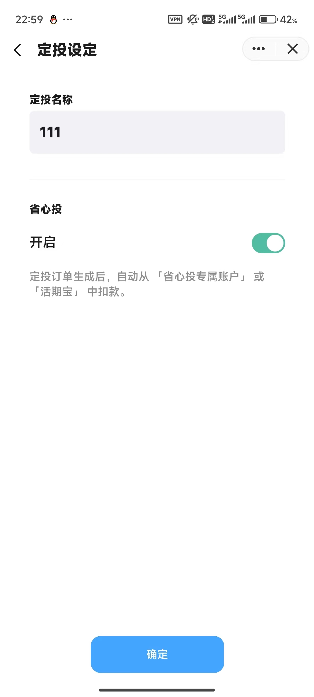
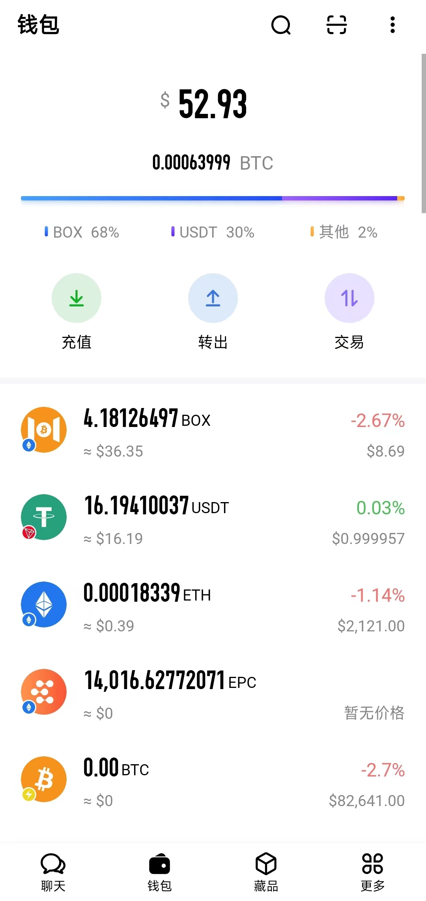
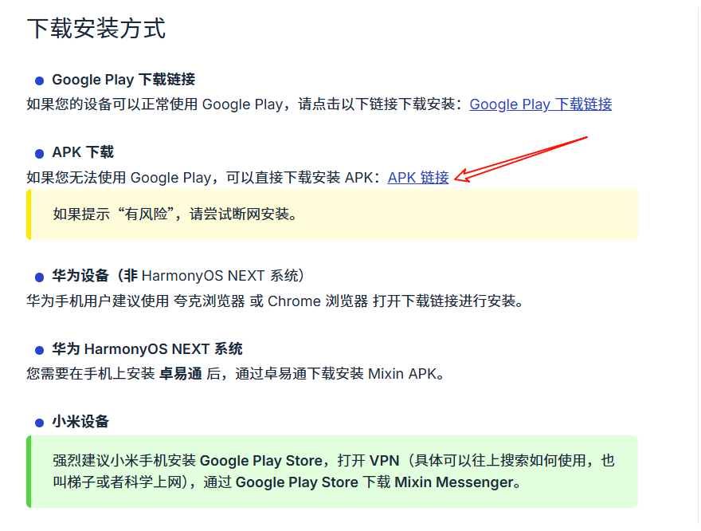

# buy BOX, about mixin

准备工作：

> 1. mixin app(可通过谷歌商店下载)
> 2. mixin 账号，可通过手机号申请
> 3. 钱(最好在银行卡里)，身份证(用于实名认证)，前置摄像头完好的手机(用于视频认证)

~~准备好了吗？准备好了我先去睡觉了~~

步骤如下：

1、 打开 Mixin APP，在APP中，最好先实名认证，用于后续的购买所必须的 [USDT](https://academy.binance.com/zh/articles/what-is-tether-usdt)

### 实名认证

实名认证在 TIGA-SAFE 中进行。机器人号码：7000104225. 可以添加到自己的通讯录。\
打开聊天界面后如图所示：\
.png>)

进入机器人后，从左到右依次是：交易，我的，个人设置(可以在这实名认证)，交易页面\
.png>).png>).png>)

一般来讲，完成 **高级认证** 后，就可以进行购买 USDT了。没有别的什么需求的话，视频认证不去做也行

### 交易 USDT 等

买的时候，这个机器人会有指导的，会进入一个同时存在 卖家，买家(你)，还有官方的一个小群，需要在里面：确认在线→发来对方收款方式→按照要求汇款→点击 \`确认付款\` → 等待对方确认收款。确认收款后，平台会自动将卖家托管的币发送给你，整个过程一般不超过半小时 (我的经验是十分钟左右)

购买后，定投的操作可以移步至 ExinOne 。机器人编号 7000101276

### 准备定投 BOX

进入 ExinOne 后，还是点击 消息栏 中消息框右侧第一个图标(长得像机器人那个，也可以像 猪鼻子)

点击进入后，为如下界面：\
.png>)\
1、 首页中，可以通过自己收藏的方式，选中感兴趣的币种，便于随时查看价格的涨跌\
2、 行情 页面，没用过，可以自行探索\
3、 交易，估计是可以及时交易，没用过那里的功能。\
4、 定投： 可以在页面中创建定投计划。开启**省心投**后，到时间可以自动执行，功能相当赞\
5、钱包： 当前没用

#### 以下，为定投界面的模样：

<figure><figcaption>
定投界面
</figcaption></figure>

#### how 创建定投

如上图，点击 \`创建定投\`，进入页面：\
.png>)

\
当前界面中：\
1、计价方式可选择 USDT、USDC 与 CNY ，(CNY 为 40元起，扣费时采用实时费率以及实时币价)\
2、投资周期可选择 月/周/天，以及对应的时间。\
3、可同时将许多种币添加到定投计划中，也可以考虑创建许多的定投计划。\
4、点击完下一步后，定投计划最终会出现在自己的定投列表中，如下图所示：

.png>)\
右图中，即为最新添加的定投计划

提示：**推荐打开 省心投 ，并将余额中的 USDT 存放到 省心投 中，可以像余额宝一样获得收益，也是 USDT**

教程结束，还有疑问，从哪看到教程的联系谁就行，我会后续再写更详细一些的。

### 答疑

1.  钱包里的那一串数字是什么意思？ 

    <figure><figcaption></figcaption></figure>

以上面的这张图为例，其中包含了上部中间的较大的数字，52.93

* 这个是指钱包里的资产加起来相当于这么多钱，是以 美元 计价的。所以是 $
* 下面的 0.000xxxxBTC ，便是比特币计价的结果，相当于 52.93 $ 约等于 0.00xxx BTC
* 再下面的颜色条以及比例，便是对应的资产，分别占据钱包里的 百分之多少
* 再往下，便是资产列表

2. 安卓手机，Mixin APP 升级怎么办？

如果是安卓机，且谷歌商店不能正常使用的，可以尝试去官网下载APK文件进行安装。官网地址：



\
进入页面后，点击 APK 链接，即可下载并安装最新版软件。
