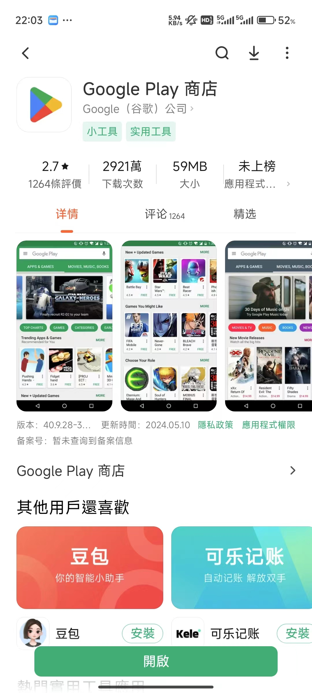
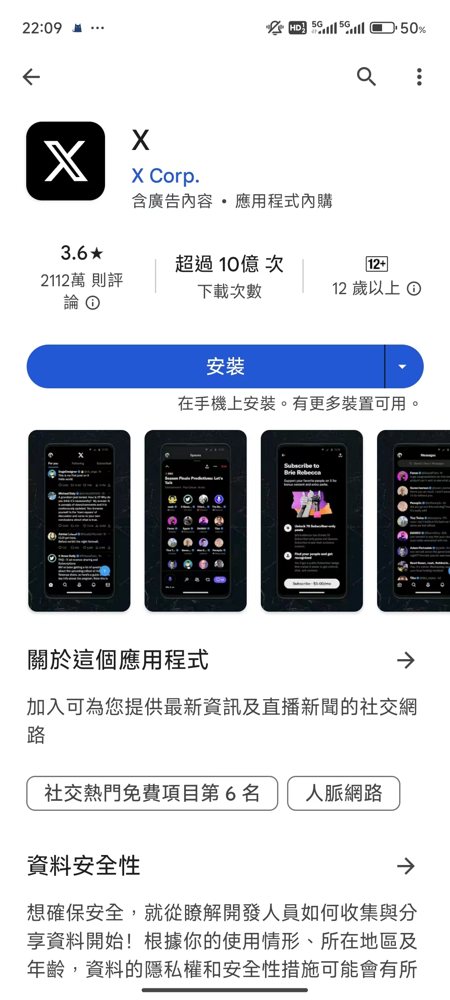

# google play & other app

如果是小米，你可以直接在应用商店中搜索 谷歌商店，然后下载。如图：

<figure><figcaption></figcaption></figure>

安装成功后，可以通过 联网  的方式打开，安装想要安装的软件，如 Instgram, X ,spotify 等软件。

<figure><figcaption></figcaption></figure>

也可以安装 chatGPT。只需要在里面像安装 QQ，微信一样，只要搜索出来，点击 `安装` 即可

<figure><figcaption></figcaption></figure>

**注意辨认：**

> 1. 软件名为 chatGPT
> 2. 图标也为如图所示
> 3. 软件厂商为 openai
>
> 为避免下载到盗版或套壳软件，请务必仔细阅读

**注意：**

**1、部分软件检测 ROOT 的方式特别强，若手机已经ROOT了，请不要安装那些软件了(我 magisk + shamiko + 隐藏应用列表+随机包名 都做了，还不管用)。尤其是金融类APP，如HSBC，BOCHK等**

**2、目前只有小米手机的，其他手机可自行上网查找，或者私聊，嘻嘻**

**附录：**

> OPPO 安装谷歌套件： [https://www.lpolaris.com/article/googleserviceoppo](https://www.lpolaris.com/article/googleserviceoppo)
>
> VIVO X70：[https://mobileai.net/2021/09/21/vivo-x70-pro-gms/](https://mobileai.net/2021/09/21/vivo-x70-pro-gms/)

