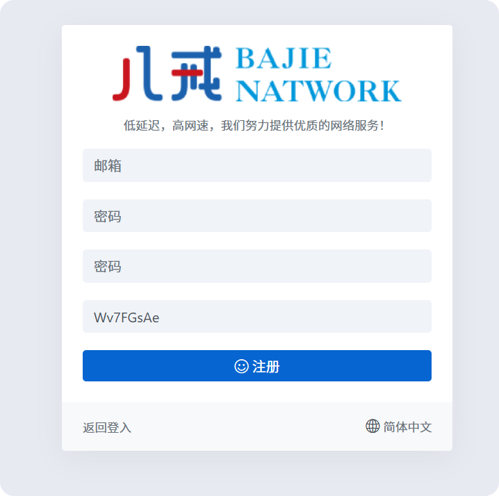
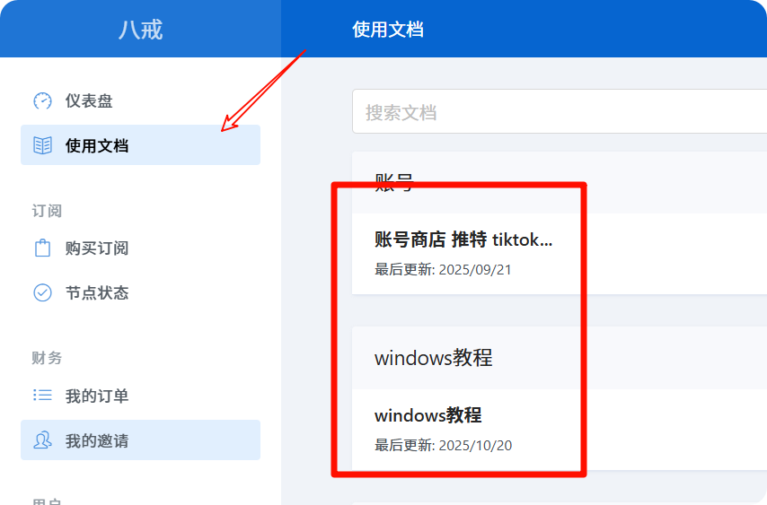
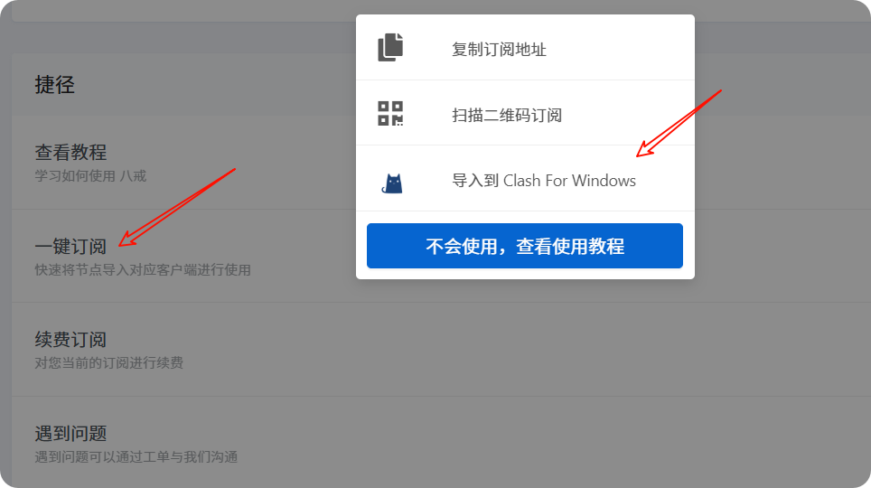
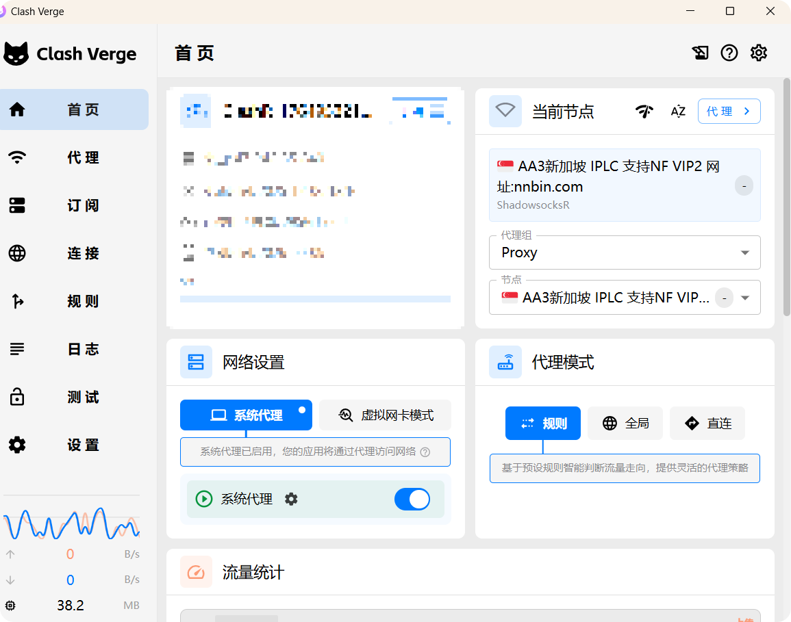
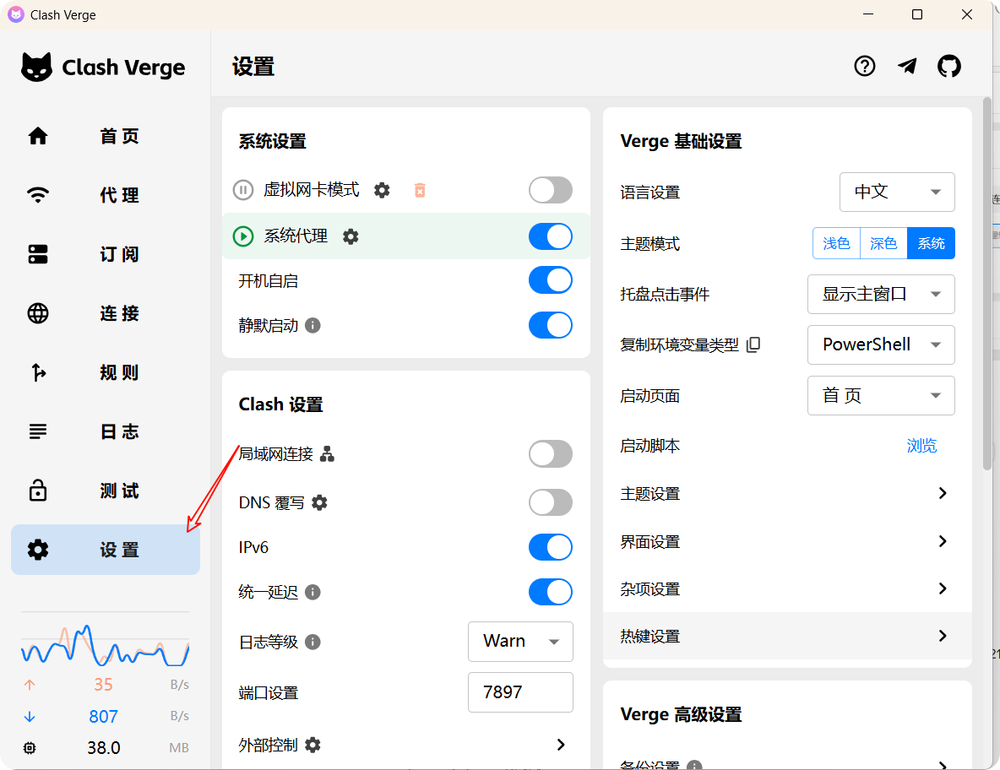
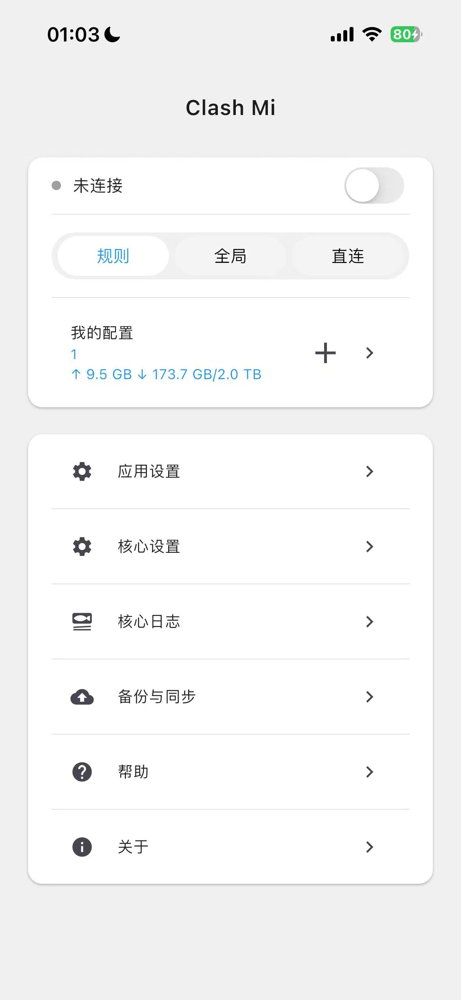
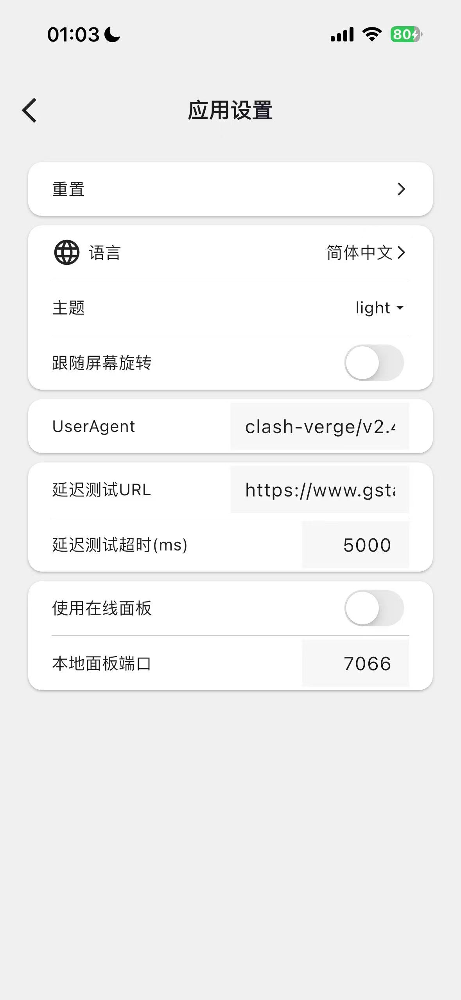
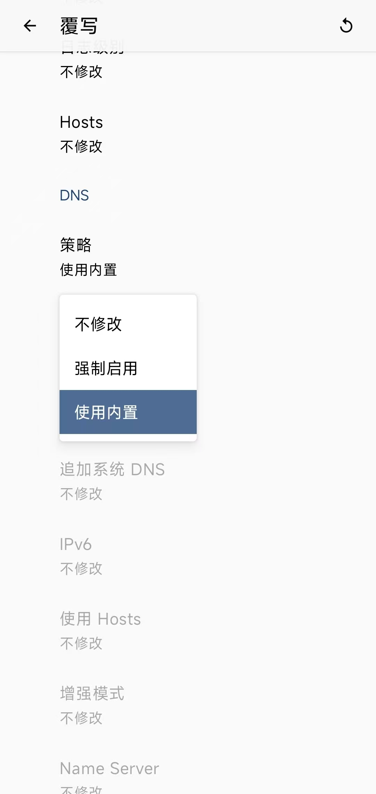

# 关于科学，从基本素养谈起

KXSW(科学上网)，以下简称 `联网` ，一向都是一个很敏感的话题，无论在哪，只要人们听到这样的词汇，总是首先神经一紧，会联想到一些不让人愉快的事情

记得小时候开始，首先提供相关服务的，往往是那些带有宗教，政治色彩的国外违法组织。他们会通过类似于 XX浏览器，XX灯 来提供服务，给分辨能力较弱的人能在互联网上畅游带来困扰。在信息流通不发达的年代，仿佛外面的信息都是那么真实，仿佛在外面才是真正的自由，才是真正的人间天堂。

互联网上也充斥着很多的所谓 公知，竭尽全力宣传着那些臭水沟，把 大表哥 看到的事物 粉饰起来。而外面也不只有我们看不到的所谓的“好”，还会有更多来自不想让我们过得好的“糖衣炮弹 ”在影响着青少年，尤其是没有建立完整世界观的青少年，他们会轻信 美国达利安 造船厂 世界第一，而不是想到，那是来自我们的 “大连”

而作为网民，最基本的素养，估计就是：兼听则明，不随便发表评论 了吧。。。。。。

话题有点大，不如直接上干货。教程开始首先是，去哪儿找相关的渠道？

由于工作性质，作为程序员的我会经常在互联网上查找一些优秀作家写的代码作品，而那些作品，往往被存放在一个叫做 Github 的地方，那儿存放着来自全球的程序员写的代码，人们在那个开源社区上面为互联网的发展做出了不可磨灭的贡献

工作过程中，也接触过可以直接访问谷歌的公司，也接触过很多相关方面的优秀工具。工欲善其事，必先利其器。这里有一个软件是真的好用，只是可惜的是，作者在一次社交平台发文中，暴露了自己的信息，然后，就没有了然后

互联网上有比我更好的教程，而我能做到的，也只是写出更直接的，更快捷的方法需要准备的有：

> 1. 一台想要 联网 的设备，如 MAC ，Windows电脑，安卓或者苹果手机，都可以的
> 2. 钱
> 3. 机场或者 VPN 软件(我这里使用的是 八戒 的机场)
> 4. 合适的浏览器：此处推荐 **Chrome** 浏览器 有战友反馈，在操作过程当中，疑似在用的浏览器问题，导致部分信息无法正常导出。

这里，以 八戒 为例（因为自己一直有在用 GPT ，这家真的很稳定，所以首选它了

1、打开网站，注册账号。链接放在右侧：https://bajie.pw/#/register?code=Wv7FGsAe

上面的如果不行，可访问下面的网页：https://bajie.la/register?aff=Wv7FGsAe

<figure><figcaption></figcaption></figure>

2、按照网站上的提示，输入自己的邮箱账号。需要确认可以收到验证码，需要在第二项中使用

3、登录后，可以在页面上查看并选择适合自己的套餐去购买。

<figure><figcaption></figcaption></figure>

此处我选择了 按流量计费 的套餐，298，只要他们开着，就可以一直用下去。我和小伙伴们拼单了，相对更划算一些，毕竟按照用量走嘛（拼单一个月 6 r，好处就是就算他们关了，还有其他机场及时作为补充）

4、下单后，可以进入**使用文档** 部分，这里有更详细的，相关平台的教程。包括 IOS，会贴心提供已购买必要软件 `shadowrocket` 的美区账号，可以在 APP store 中登录账号并直接下载软件。

<figure><figcaption></figcaption></figure>

5、在首页，可以通过点击 `一键订阅` 按键，将订阅导入 clash for Windows。如果你正在使用的设备是Windows 系统的电脑的话。\*(此处更推荐 [clash verge](https://github.com/Clash-Verge-rev/clash-verge-rev/releases))

<figure><figcaption></figcaption></figure>



Clash Verge 的 Windows 界面如下：

<figure><figcaption></figcaption></figure>

首页中，系统代理 选项需要打开。不打开连接不上

1. 可以考虑开启的有： 开机启动。其他的可以忽略，保持默认

<figure><figcaption></figcaption></figure>

### 附录

1. 也会觉得，另一款的机场也是很适用的。官网链接为：[MDOOS](http://mdoos.pw/)
2. Clash Verge 怎么用呢？我觉得人家官方的文档会更好一些。链接放在这儿了：

https://www.clashverge.dev/guide/quickstart.html

3. 那么，手机呢？

如果你是 IPhone，有一个 clash 也可以使用：https://apps.apple.com/us/app/clash-mi/id6744321968?l=zh-Hans-CN

或者，也可以使用小火箭：shadowrocket。

此时可以在机场的网页里找到共享的美区ID，下载该应用，下载后从 App Store 里退出即可

如果是安卓，可以试试 clash Meta for Android：https://github.com/MetaCubeX/ClashMetaForAndroid/releases/download/v2.11.20/cmfa-2.11.20-meta-arm64-v8a-release.apk

4. Clashmi 导入链接 504 ，怎么办

<figure><figcaption></figcaption></figure> <figure><figcaption></figcaption></figure>

更改 UserAgent 为 clash-verge/v2.4.3

clash-verge/v2.4.3

然后，再次导入链接即可

5. 关于 DNS覆写

当我们使用 Clash 的一些机场去访问一些网站的时候，可能遇到访问不了的情况。如 GitHub。而切换到别的机场的时候，就可以访问。此时我们就会去怀疑，是不是这个机场有问题呢？

可能，这是因为我们的 DNS 在此刻还是被污染的状态，那么，我们只要打开 DNS覆写 的功能，就可以访问了。如图所示：

<figure><figcaption></figcaption></figure> <figure><figcaption></figcaption></figure>

参考链接： [https://blog.lucyqin.cn/?p=1874#h36](https://blog.lucyqin.cn/?p=1874#h36)

 
