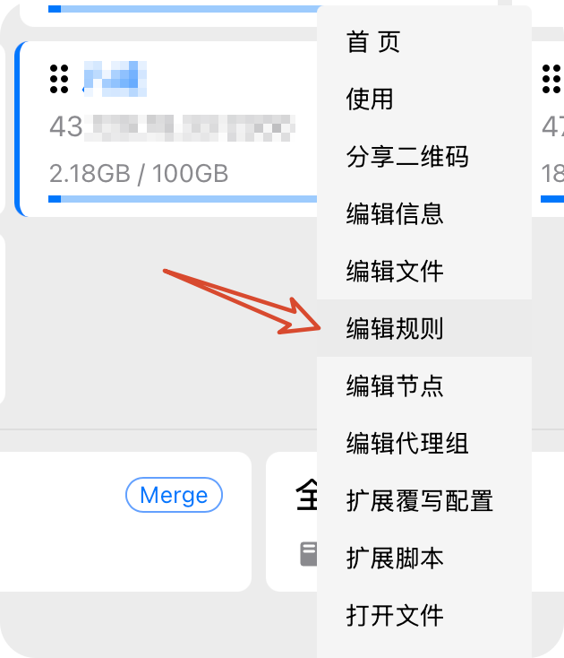
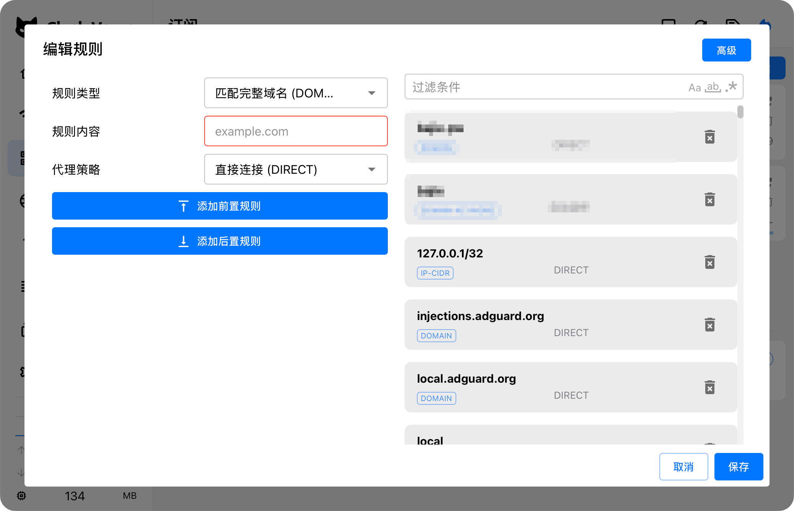
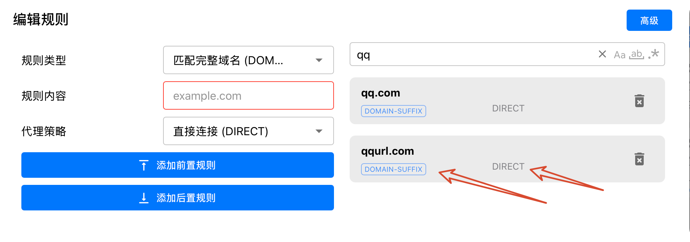
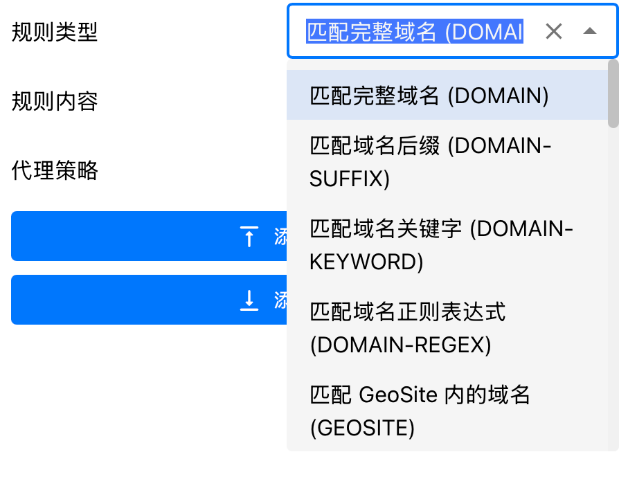
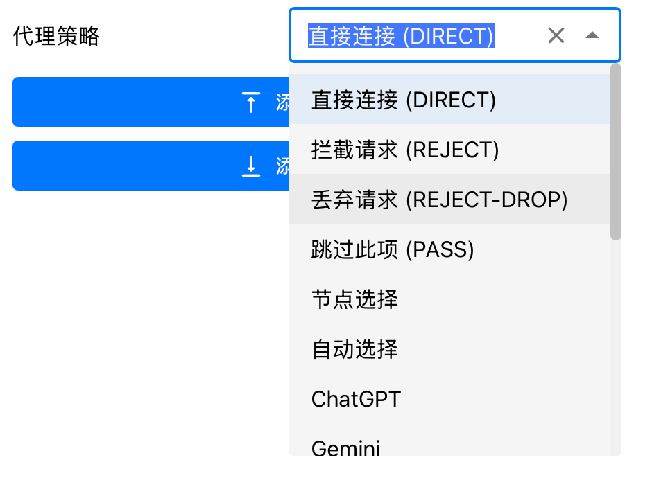
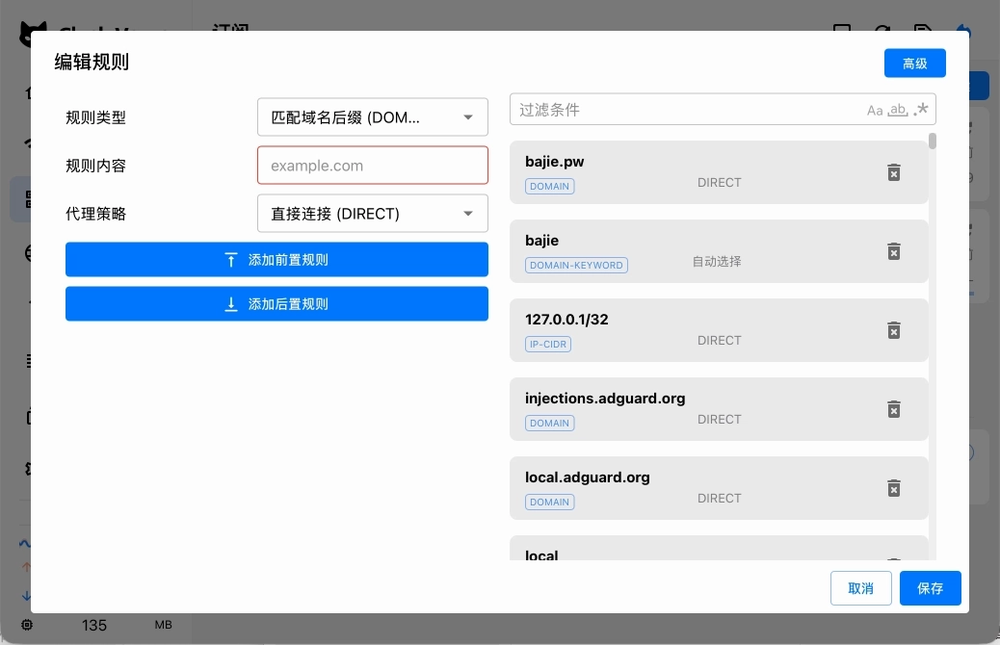
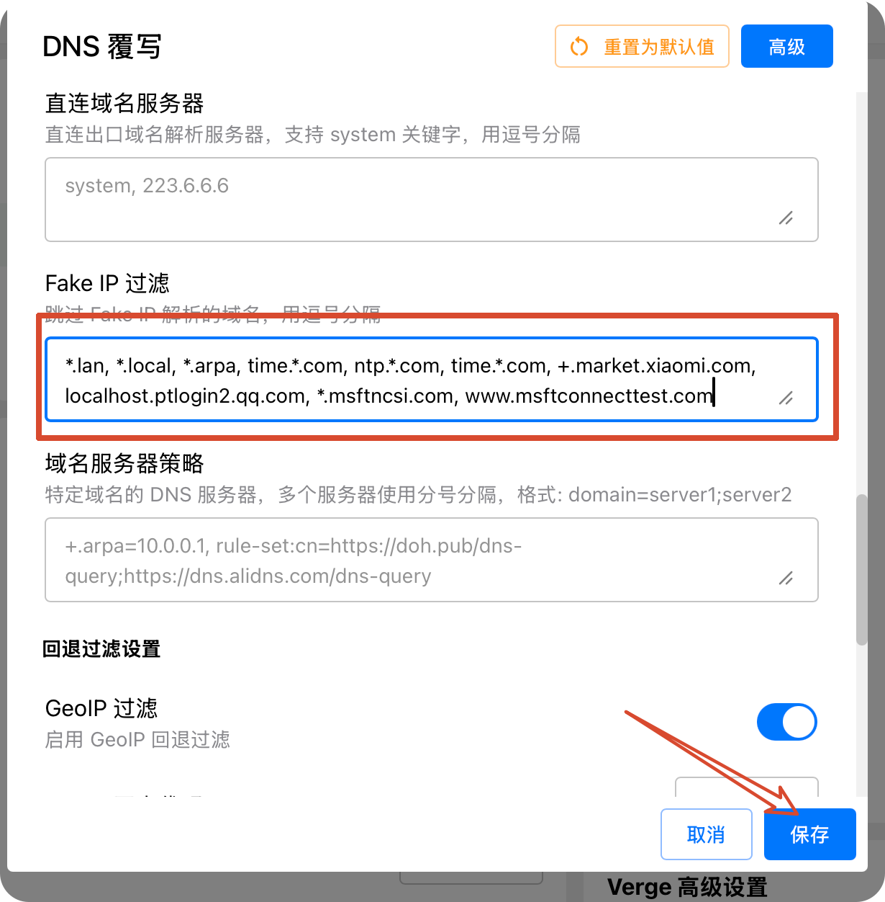

# jiqiao

明明我想让访问这个网页的时候使用直接连接，但它还是走了节点，平白无故消耗了我更多的套餐流量。那该怎么办呢？

为了解决这个问题，我们可以往下看......

### 订阅层面

首先是订阅层面，如果你设置了半小时或者一小时更新一次订阅的话，你可以去看下一个方法（该方法容易被更新后的订阅所覆盖，所以不大推荐）

首先到我的订阅页面，鼠标右键并点击 编辑规则，出现下图所示：

在图 2 的右半部分可以看到，有的网页是走的 Direct，也就是直接连接到页面；此时，这些链接不需要通过代理的 IP



<figure><figcaption></figcaption></figure>



<figure><figcaption></figcaption></figure>



那我接下来该如何设置想要的网站业务直接连接呢？

<figure><figcaption></figcaption></figure>

通过上图中，我们可以发现：使用的规则类型是 Domain Suffix，走的是 DIRECT。打开规则类型列表，我们会发现，这是域名后缀匹配；而在代理策略这一栏，也有很多选项



<figure><figcaption></figcaption></figure>



<figure><figcaption></figcaption></figure>



比如我们想通过配置去设置好 123 点 com 为直接连接，就可以像下图一样：

<figure><figcaption></figcaption></figure>

### DNS 覆写

这种方法可能会更持久一些，而且一般不会失效（想想看，我们可能会在一些敏感的时间点会去各种切换订阅链接，所以 DNS 覆写的方式会更持久。）

这个方法可以帮助我们将一些网站导向正确的地址，起辅助作用，不能作为主力

如下图图二所示，我们可以将想要 fake 掉的域名输入进去后(\*.hao123.com)，点击保存即可



<figure><figcaption></figcaption></figure>





<figure><figcaption></figcaption></figure>



### Merge 脚本

推荐方案：全局扩展覆写配置

路径：

```
Clash Verge→ 设置→ 全局扩展覆写配置
```

这里的配置会额外合并到所有订阅配置中。

因此：

* 更新订阅不会丢失
* 切换不同机场不会丢失
* 个人规则可以统一维护

***

### 添加直连规则

默认配置：

```
profile:  store-selected: true
```

修改为：

```
profile:  store-selected: truerules:  - DOMAIN-SUFFIX,example.com,DIRECT
```

例如：

```
profile:  store-selected: truerules:  - DOMAIN-SUFFIX,github.com,DIRECT  - DOMAIN-SUFFIX,company.com,DIRECT
```

***

### 规则说明

#### DOMAIN

匹配完整域名：

```
DOMAIN,example.com,DIRECT
```

只匹配：

```
example.com
```

***

#### DOMAIN-SUFFIX

匹配域名及所有子域名：

```
DOMAIN-SUFFIX,example.com,DIRECT
```

可以匹配：

```
example.comwww.example.comapi.example.com
```

通常更推荐使用 `DOMAIN-SUFFIX`。

***

## 注意：规则顺序

Clash 规则按照从上到下匹配。

例如：

```
rules:  - DOMAIN-SUFFIX,example.com,DIRECT  - MATCH,Proxy
```

访问：

```
example.com
```

会：

```
example.com ↓匹配第一条规则 ↓DIRECT
```

如果顺序反过来：

```
rules:  - MATCH,Proxy  - DOMAIN-SUFFIX,example.com,DIRECT
```

那么所有流量都会提前匹配 Proxy。

***

## Fake IP 过滤是否需要配置？

很多人容易混淆：

```
Fake IP 过滤 ≠ DIRECT
```

Fake IP 过滤只负责：

```
域名解析方式
```

而规则负责：

```
流量走向
```

***

### 普通网站

只需要：

```
rules:  - DOMAIN-SUFFIX,example.com,DIRECT
```

即可。

***

### 特殊场景

如果网站属于：

* NAS
* 局域网设备
* 公司内网
* `.local` 域名
* 某些不兼容 Fake IP 的应用

可以额外加入：

```
dns:  fake-ip-filter:    - "*.example.com"
```

作用：

让该域名使用真实 DNS 解析。

但它不会让网站自动直连。

***

## DNS 覆写和规则的区别

### DNS 覆写

作用：

```
域名 → IP
```

例如：

```
nas.local ↓192.168.1.10
```

解决：

* DNS 解析错误
* Fake IP 兼容问题

不能解决：

```
走代理还是直连
```

***

### Rule 规则

作用：

```
流量 → DIRECT / Proxy
```

例如：

```
example.com ↓DIRECT
```

用于：

* 指定网站直连
* 指定网站代理

***

## 推荐配置方式

对于大多数用户：

```
profile:  store-selected: truerules:  - DOMAIN-SUFFIX,your-site.com,DIRECT  - DOMAIN-SUFFIX,another-site.com,DIRECT
```

即可。

***

## 如何确认是否成功？

打开：

```
Clash Verge→ 日志
```

访问目标网站。

如果看到：

```
DIRECT
```

说明已经绕过代理。

如果显示：

```
Proxy
```

说明规则没有命中，需要检查：

1. 域名是否正确
2. 规则顺序是否靠前
3. 是否被其他规则提前匹配

***

## 总结

| 方法          | 作用         | 是否推荐  |
| ----------- | ---------- | ----- |
| 全局扩展覆写 Rule | 控制网站走直连/代理 | ⭐⭐⭐⭐⭐ |
| 订阅内修改规则     | 临时有效       | ⭐⭐    |
| DNS 覆写      | 修改域名解析     | ⭐⭐⭐   |
| Fake IP 过滤  | 解决解析兼容问题   | ⭐⭐⭐   |
| 浏览器 PAC     | 仅浏览器有效     | ⭐     |

对于经常更新订阅、切换机场的用户，最佳方案是：

**使用 Clash Verge 全局扩展覆写配置维护自己的 DIRECT 规则。**
