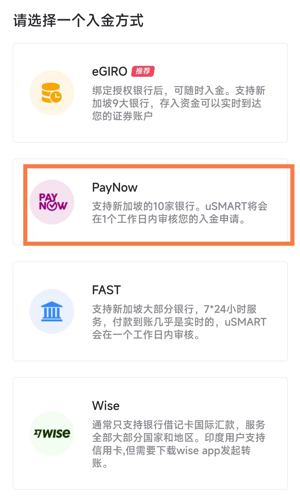

# USmart入金-OCBC

<figure><figcaption></figcaption></figure>

当此时，如何快速入金并开始投资 港股/美股 就是我们需要首先考虑的事情了。而此时，银行 APP 上首页映入眼帘的 **PayNow** ，就是此时最好的方式，也是最方便的方式

在 Usmart 中，可以在这里选择：\
 (1).png>)

可以参考 usmart 里的教程，然后在银行APP中操作。一般需要等一天的时间，一天内咋也到账了。如果没到账，多等等，两个工作日内就能到账啦

